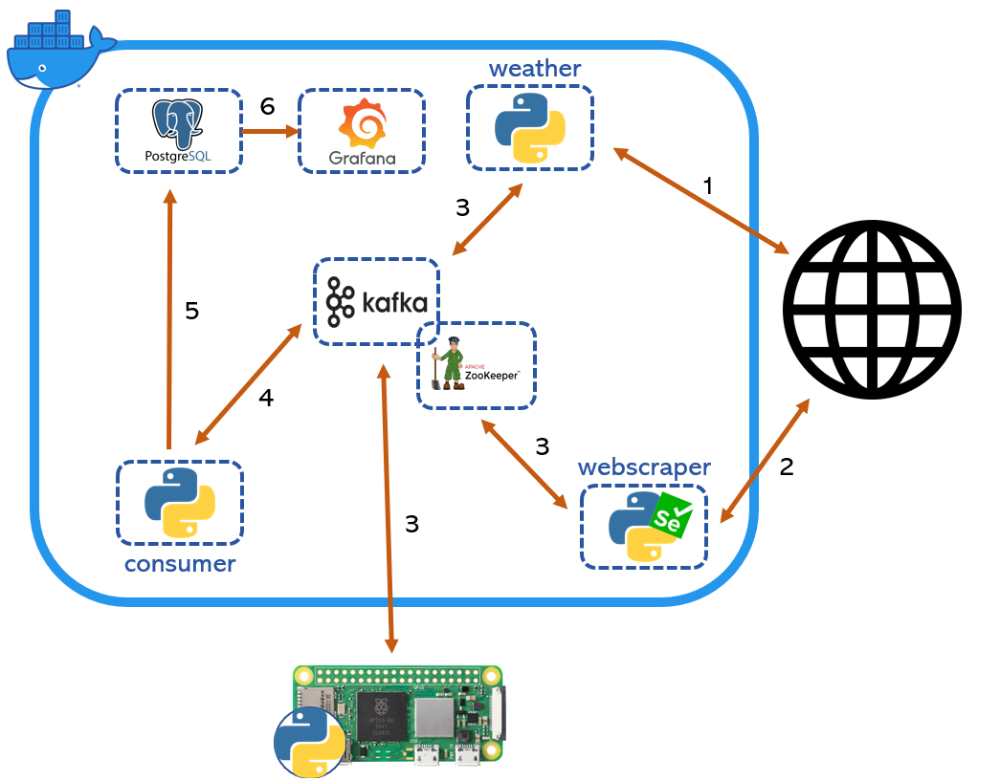

# Overview

This is a simple data engineering project in order to learn more about kafka, docker, webscraping and grafana.



1. ```weather``` docker container collects weather observations and forecasts by using the the open API provided by [SMHI](https://opendata.smhi.se/apidocs/). 
2. ```webscraper``` docker container scrapes the energy prices in sweden for the next day from [Nordpool](https://www.nordpoolgroup.com/en/Market-data1/Dayahead/Area-Prices/SE/Hourly/?view=table)
3. producers write meessages to the ```db_ingestion``` topic
4. ```consumer``` reads from the ```db_ingestion``` topic 
5. ```consumer``` writes the data from the ```db_ingestion``` topic to the postgresDB.
6. ```grafana``` queries the postgresDB for data in order to visualize it.

# Prerequisites

- Docker
- Docker compose
- A ds18b20 sensor
- Some sort of raspberry pi (I use nano)

# Set up

## .env file
Create a file called ```.env``` in the build directory.

```env
DBUSER = '<username for postgresdb>'
DATABASE = '<database name>'
PASSWORD = '<password for dbuser>'
POSTGRES_IP = '<ip for machine hosting postgres docker>'
POSTGRES_PORT = '<HOST_PORT for the postgres docker, default is 5432>'
KAFKA_IP = '<ip for machine hosting kafka docker>'
KAFKA_PORT = '<HOST_PORT for the kafka docker, default is 9092>'
ZOOKEEPER_PORT = '<HOST_PORT for the zookeeper docker, default is 2181>'
GRAFANA_PORT = '<HOST_PORT for the grafana docker, default is 3000>'
```

## Docker

On the machines that will host the docker images, make sure that ```docker``` and ```docker compose``` is installed. See the links below for more information.

https://docs.docker.com/compose/install/
https://docs.docker.com/engine/

The docker images does not need to run on the same machine except for the ```zookeper``` and ```kafka``` images. If a more complex and distrubuted set up is desired, the ```docker-compose.yml``` will need to be changed accordingly.  

When starting up the images for the first time, build and start them one by one to make sure everything runs smoothly. If you want to go crazy and build and run everything in one go on the same machine, use the ```build``` and ```up``` commands defined in the ```Makefile```. Since some of the images are depending on other images, I recomend to start them in the following order:

1. ```zookeper```
2. ```kafka```
3. ```postgres```
4. ```consumer```
5. ```weather```
6. ```webscraper```
7. ```grafana```

To first build and the run the docker image, run the following commands.
```docker compose build <docker image name>```
```docker compose up <docker image name>```

## Temperature sensor

Connect the ds18b20 sensor to your pi device. If you are unsure how to do it, follow this [tutorial](https://www.circuitbasics.com/raspberry-pi-ds18b20-temperature-sensor-tutorial/).

Install dependencies on the pi.

```bash
pip install kafka-python
pip install python-dotenv
```
Transfer files to device
```bash
scp -r temperature-sensor pi@pi-node:/home/pi/temperature-sensor
```
Setup cronjob to run on the first minute every hour.
```bash
crontab -e
0 * * * * python temperature-sensor/temp-sens-producer.py
```

## Grafana

When the docker images have been up for a while, have a look at the grafana dashboard to se the data that has been collected. Access grafana at ```<GRAFANA_HOST_IP>:<GRAFANA_PORT>``` in any webbrowser. It should look something like this:

...